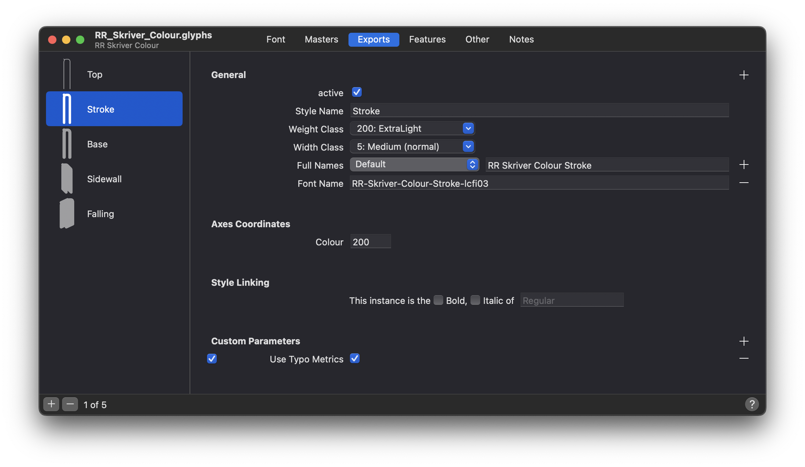

# LCFI: Layered Colour Font Index (proposal)
> **Status:** Draft • **Scope:** naming convention for layered colour fonts + example scripts and demo fonts


A compact naming convention for encoding layer order right in a font’s **Name ID 6 (PostScript Name)** so that apps and scripts can discover, sort, and group layered colour fonts – without affecting what users see in UI style pickers.

## TL;DR
- Append a suffix `-lcfiNN` to **PostScript Name** where `NN` is a two-digit layer index (`00–99`).
- Due to suffixes, scripts can discover, sort, and group layers.
- Lower index → deeper (back) layer.
- UI (menus) can keep the human-friendly **Full Names**; scripts operate on the **PostScript Name**.
- Example:  
`RR-Skriver-Colour-Falling-lcfi00`, `RR-Skriver-Colour-Sidewall-lcfi01`, `RR-Skriver-Colour-Base-lcfi02`, `RR-Skriver-Colour-Stroke-lcfi04`, `RR-Skriver-Colour-Top-lcfi04`


---

## Table of contents
- [Motivation](#motivation)
- [Design goals](#design-goals)
- [Specification](#specification)
  - [Semantics](#semantics)
  - [Name format](#name-format)
  - [Examples](#examples)
  - [How to set it](#how-to-set-it)
  - [Interface behavior](#interface-behavior)
- [Usage with scripts (Adobe Illustrator)](#usage-with-scripts-adobe-illustrator)
- [RR Skriver Colour (typeface)](#rr-skriver-colour-typeface)
- [FAQ](#faq)
- [Licensing](#licensing)

---

## Motivation

Modern colour font formats (SVG, COLR/CPAL) face practical limitations in today’s tools. They still lack native ways to adjust colours in print workflows. For that reason, layered colour fonts remain the most reliable approach. But managing them isn’t smooth: users type once, then must manually duplicate, change style, stack, and recolour layers.

**LCFI** aims to make layered workflows feel closer to “single-font” colour fonts: type once, let scripts assemble and order layers automatically, then adjust colours globally.

---

## Design goals
- To simplify the use of layered colour fonts.
- To keep font family and style names free from technical noise.
- To cover essential routine tasks.
- To showcase the approach with real scripts and a working font.

---

## Specification

### Semantics

- Z-order: The lower the index, the lower (back) the layer sits.
- Index range: 00–99 (two digits with a leading zero).


> Even with cutout designs (non-overlapping layers), LCFI helps by auto-stacking and assigning global swatches per layer.

### Name format
```
<PostScript-Name>-lcfiNN
```

Where:

`lcfi` — Layered Colour Font Index
`NN` — two-digit layer index (`00`, `01`, …, `98`, `99`)

### Examples
```
RR-Skriver-Colour-Falling-lcfi00
RR-Skriver-Colour-Sidewall-lcfi01
RR-Skriver-Colour-Base-lcfi02
RR-Skriver-Colour-Stroke-lcfi03
RR-Skriver-Colour-Top-lcfi04
```

> **Note:** Keep within PostScript name constraints (ASCII letters, digits, hyphens; no spaces). Adding `-lcfiNN` consumes part of the name length budget.

### How to set it
Set the suffix on **Name ID 6 (PostScript Name).** Keep **Name ID 4 (Full Name)** human-readable.

Glyphs App examples:

1. Open **Font Info**.

2. In **Font Name** (PostScript name), append `-lcfi00` (or `-lcfi01`, etc.).

3. In **Full Names**, keep a user-friendly style name.

> **Important:** Do not skip indexes. For example, missing `lcfi02` while `lcfi03` available will cause provided scripts to stop assembly at `lcfi01`.


### Interface behavior

After exporting fonts with the `lcfi` suffix:

- End-users will still see the familiar style names in typical menus (derived from Full Name).

- Scripts can operate on layers by parsing the PostScript Name.

---

## Usage with scripts (Adobe Illustrator)
This repository includes example Adobe Illustrator scripts that demonstrate the LCFI workflow.
| Script          | Purpose                                                                                         |
|:----------------|:------------------------------------------------------------------------------------------------|
| LCFI colour it  | Finds all layers by `lcfi` suffix, groups them, and creates global colours for easy recolouring.|
|                 |                                         |
| LCFI sort it    | Sorts objects in a group by ascending `lcfi` suffix (back → front).                             |
|                 |                                             |
| LCFI show names | Lists PostScript Names of fonts used in the document to verify LCFI compliance.                 |

> The scripts are illustrative and were initially generated with AI assistance.
>   
>   
> [](https://github.com/ruzvaliakhmetov/lcfi-naming-convention/raw/main/scripts/LCFI-scripts.zip)

**Installation:**
1. Place `.jsx` files into Illustrator’s `Scripts` folder.
2. Restart Illustrator.
3. Run via **File → Scripts.**

---

## RR Skriver Colour (typeface)


A layered type family with implemented LCFI indexes is included for testing and demos.

Fonts are distributed under the OFL; see [Licensing](#licensing).

[](https://github.com/ruzvaliakhmetov/lcfi-naming-convention/raw/main/fonts/ttf/RR-Skriver-Colour-TTF.zip)
[](https://github.com/ruzvaliakhmetov/lcfi-naming-convention/raw/main/fonts/otf/RR-Skriver-Colour-OTF.zip)

---

## FAQ

**Why Name ID 6 (PostScript Name)?**  
It’s stable, machine-readable, and not typically exposed to end-users the way Full Name is. That makes it ideal for automation without cluttering UI elements.


**Why two digits?**  
Keeps parsing trivial and ordering explicit, while covering most practical layered designs (up to 100 layers).


**Can I start at `lcfi01?`**  
You *can*, but best practice is to start at `lcfi00` and go up contiguously.

**What about COLR/CPAL?**  
Where full colour redefinition UIs are unavailable or incomplete, LCFI lets layered fonts behave predictably today. If/when UI support matures, LCFI can still coexist for legacy and print workflows.

---

## Licensing

- **Scripts:** MIT — see [LICENSE](/licenses/MIT_license.txt)
    > PROVIDED “AS IS”, WITHOUT WARRANTY OF ANY KIND, EXPRESS OR IMPLIED. IN NO EVENT SHALL THE AUTHORS OR COPYRIGHT HOLDERS BE LIABLE FOR ANY CLAIM, DAMAGES OR OTHER LIABILITY.

- **Fonts:** RR Skriver Colour typeface has been distributed under the SIL Open Font License, Version 1.1. This license is available with a FAQ at http://scripts.sil.org/OFL
 
---